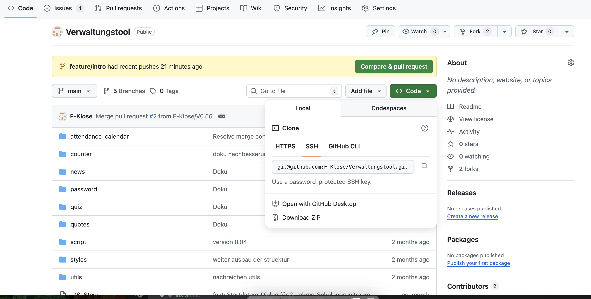
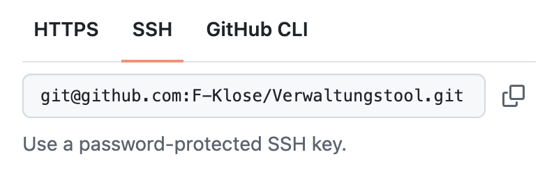

### Istallation des Verwaltungs tools 
## Voraussetzungen:
1. GitHub-Konto: Ein GitHub-Konto wurde mit dem Dozenten eingerichtet.
2. SSH-Schlüssel: Ein SSH-Schlüssel wurde in deinem GitHub-Konto hinterlegt.
3. Terminal-Kenntnisse: Du bist vertraut mit der Nutzung des Terminals/der Kommandozeile.(Falls nicht, wende dich bitte an deinen Dozenten oder Lehrer, um eine Einführung zu erhalten.)
4. Lokale Ordnerstruktur: du verstehst, dass die Namen meiner lokalen Ordner von deinen abweichen können.
5. Selbstständigkeit: DU versuchst, die Aufgabe selbstständig umzusetzen und wendest dich nur bei auftretenden Fehlern an den Dozenten.

---

### schritt 1 
rufe die webseite auf "https://github.com/F-Klose/Verwaltungstool/tree/main"

Klicke auf die grüne Schalt fläche "Code", dann geht ein Fenster auf.
Dies sollte so aussehen:


--- 

### im popup 

Hier siehst du ein Pop-up-Fenster, dieses beinhaltet drei Tabs. Klicke auf SSH.
1. HTTPS
2. SSH <- hier 
3. GITHUB CLI 



--- 

### im SSH tab 

kopiere den link aus dem fenster 


Markiere alles und drücke COMMAND + C oder nutze den Button, um die Zeile in den Zwischenspeicher aufzunehmen.

---
 
 ### terminal 
1. Öffne das Terminal.

2. Nutze den Befehl cd (Change Directory), um in das Verzeichnis zu navigieren, in dem du das Repo (Repository) anlegen willst.


 ---

 ### im Ordner angekommen 

Jetzt, wo du an der Stelle bist, wo du das Repo anlegen willst, musst du den Befehl "git clone" mit der Zeile aus deinem Zwischenspeicher kombinieren.

Das sollte dann so aussehen:

wen das bei dir ao aus sieht drücke enter 

 --- 

### der Download 

Jetzt wird eine Menge in deinem Terminal passieren. Lasse es in Ruhe arbeiten. Wenn es fertig ist, machen wir weiter.

Wenn es in etwa so aussieht, ist der Download abgeschlossen:


---

### öffne VS code 
1. Öffne das jetzt installierte Repo in VS Code.
2. Klicke auf "Öffne neues Terminal" in der oberen rechten ecke .


---

### entwicklungs umgebung anlegen 


Hier gibst du nun folgende Befehle der Reihe nach ein:
```bash
python3 -m venv verwaltungstool
source verwaltungstool/bin/activate
pip install -r requirements.txt
```
wen das jetzt so aus sieht dann hast du alles richti gemacht :


---

### was ist da gerade passiert 

1. Du hast eine Entwicklungsumgebung geschaffen.

2. Du hast bestätigt, dass du innerhalb dieser Umgebung arbeiten willst, und diese aktiviert.

3. Du hast alle benötigten Zusatzpakete, die für das Repo gebraucht werden, installiert.

---

### was jetzt 

Wir sind fertig – du bist startbereit!

Im Hauptverzeichnis kannst du die main.py ausführen. Klicke die Datei an und drücke dann oben auf Start.

Schau dir die README an, wenn du weitere Fragen haben solltest.

Viel Spaß!


